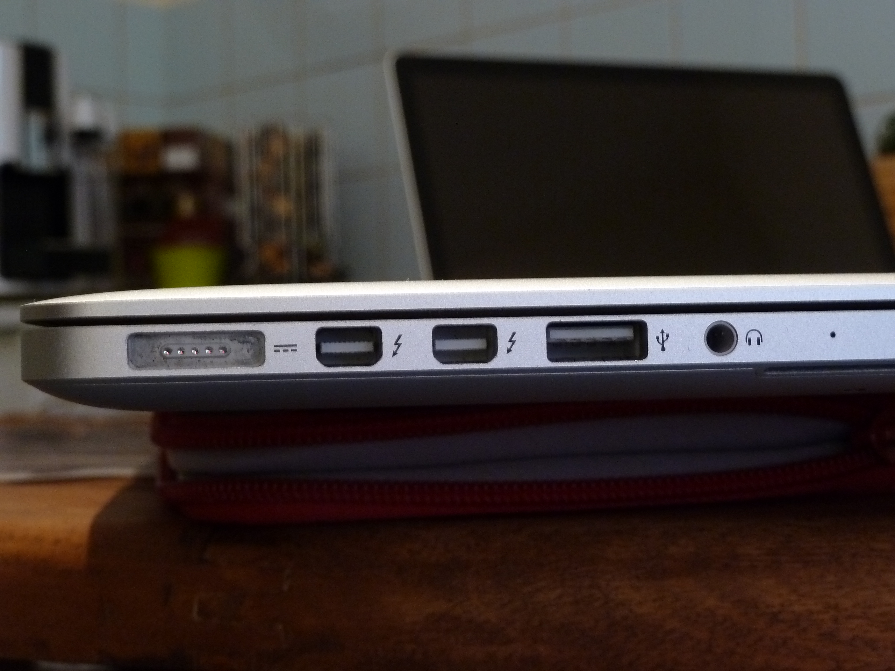

**MON BLOGUE**
==============

# Les interfaces

- firewire
- thunderbolt
- ethernet
- USB
- HDMI

<https://github.com/adam-p/markdown-here/wiki/Markdown-Cheatsheet>

<http://unicode-table.com/fr/search/?q=flèche>

# Systèmes d'exploitation:

- OS X
- Windows
- Linux
- Unix

# Les périphériques de stokage:

- Micro SD
- CD
- clef USB
- Disque dur magnétique
- carte SD

# Bureau à distance

VNC
Aller dans le finder
cmd + K
vnc://nico@nicomac.local

http://haihaihub.github.io/mon_blogue

# 2015-09-19

Donner les droits d'administration à un utilisateur
