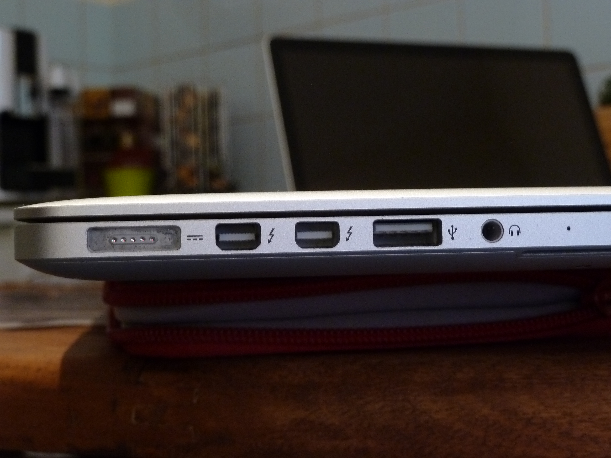
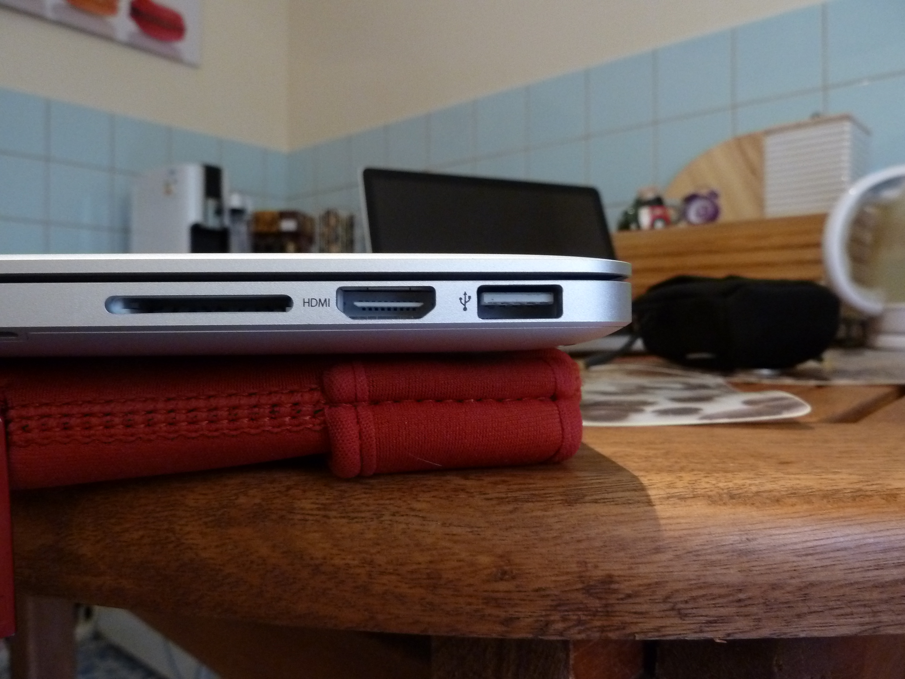
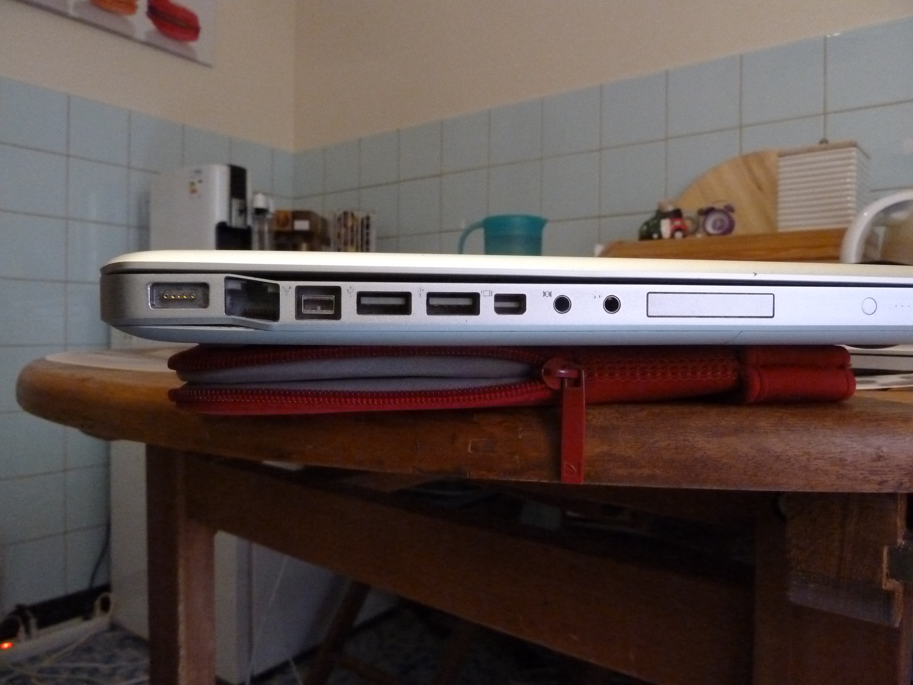

**MON BLOGUE**
==============

# Les interfaces

- firewire
- thunderbolt
- ethernet
- USB
- HDMI

<https://github.com/adam-p/markdown-here/wiki/Markdown-Cheatsheet>

<http://unicode-table.com/fr/search/?q=flèche>

# Systèmes d'exploitation:

- OS X
- Windows
- Linux
- Unix

# Les périphériques de stokage:

- Micro SD
- CD
- clef USB
- Disque dur magnétique
- carte SD

# Bureau à distance

VNC
Aller dans le finder
cmd + K
vnc://nico@nicomac.local

http://haihaihub.github.io/mon_blogue

# 2015-09-19

Donner les droits d'administration à un utilisateur

Dossier = Folder (mac)   (windows) ou (linux) =répertoire = directory.

Ne pas confondre avec les fichiers = files

Voila des commandes pour le Terminal

- ls => Listing des répertoires et fichiers
- pwd => print working directory
- git status
- git add .
- git commit -m "commentaires"
- git push (mettre sur internet) = upload
- git pull (prendre d'internet) = download

# 2015-09-26

## Utilisation de DTerm

cmd + shift + enter => ouvre DTerm

ls + enter => exécute `ls` dans DTerm

ls + cmd + enter => exécute `ls` dans Terminal

## Finder

- Proxy Icon + clique => Affiche répertoire

# Gimp

## Ouvrir fichier

- Glisser + Déposer
- cmd + O dans Gimp
- clique droit sur le fichier + ouvrir avec ...

Pixel = Picture element

# Préfixes

- kilo 10^3   1000
- mega 10^6   1000000
- giga 10^9   1000000000
- tera 10^12  1000000000000
- peta 10^15  1000000000000000
- exa  10^18  1000000000000000000

!! Les ordis comptent en base 2 donc le kilo = 1024

Synthèse additive (écran) => RVB = Rouge, Vert, Bleu
Synthèse soustractive (imprimante) => Cyan, magenta, jaune (+ noir)

# 2015-10-22

ls/dev (listing du répertoire)
grep usb (filtre les résultats qui contiennent le mot usb)
pipe (alt+7) envoye le résultat

~230 px/lm = Pixel par pouce
écran retina = ~230 px/in = résolution ou définition
écran standard = ~130 pt/in
2,54cm = 1 inch = 1"
